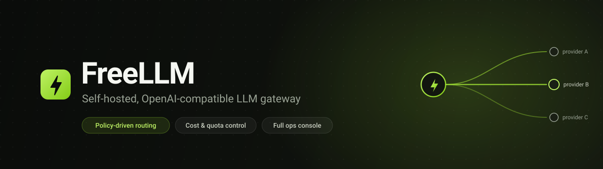
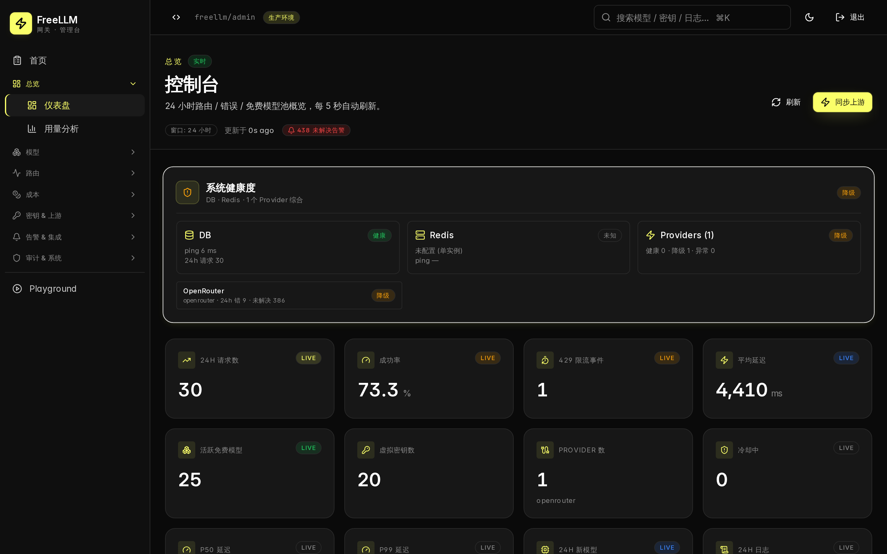
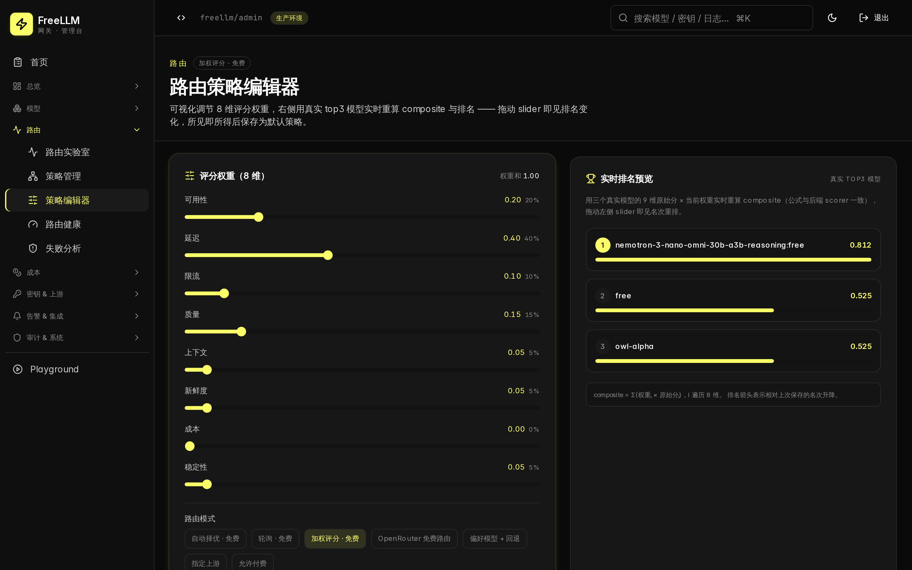
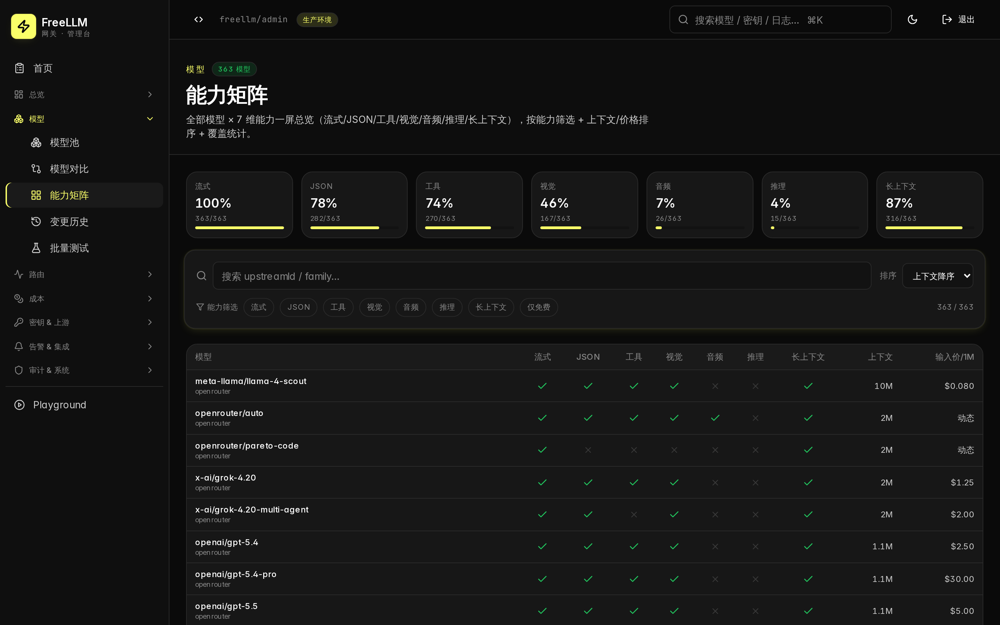
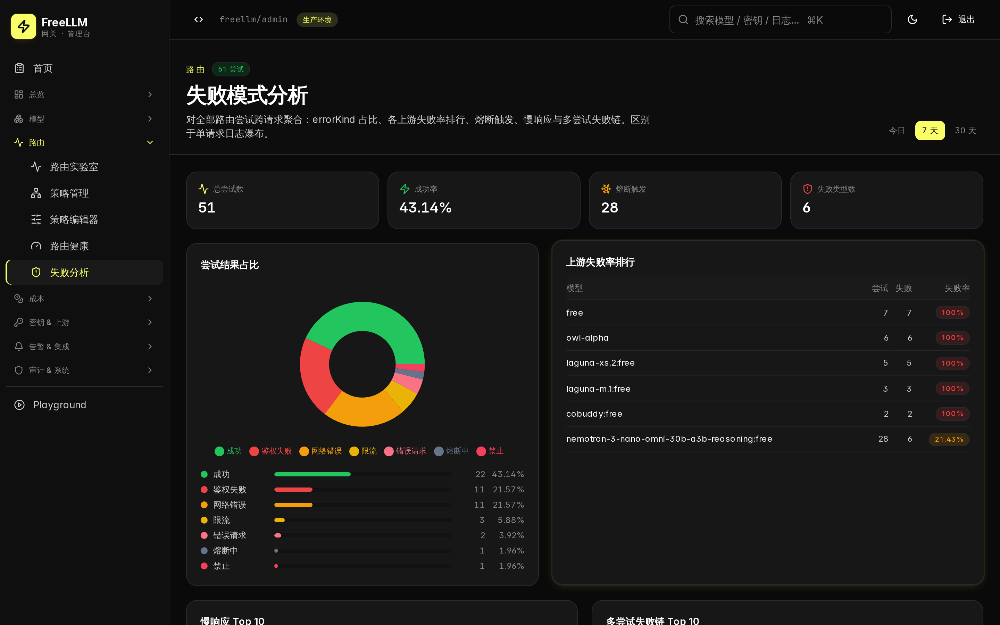
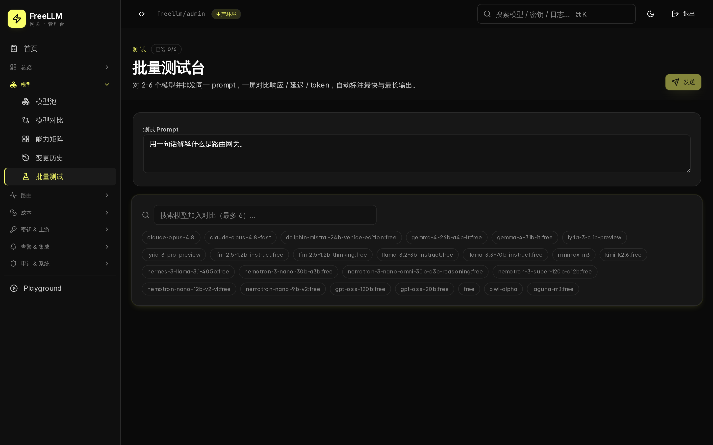

<p align="center">
  
</p>

<p align="center">
  <a href="LICENSE"></a>
  
  
  
  
  
</p>

<p align="center">
  <b>One stable OpenAI-compatible API in front of many shifting LLM providers</b><br>
  Policy-driven multi-provider routing · cost governance · alerting · multi-tenancy · full operations console.
</p>

<p align="center">
  <a href="#quick-start">Quick start</a> ·
  <a href="docs/ARCHITECTURE.md">Architecture</a> ·
  <a href="docs/API.md">API</a> ·
  <a href="docs/DEPLOYMENT.md">Deploy</a> ·
  <a href="README.zh.md">中文</a>
</p>

---

FreeLLM sits between your applications and upstream providers (OpenRouter, OpenAI, Anthropic, or any OpenAI-compatible endpoint). Downstream it speaks the standard OpenAI API, so existing SDKs work unchanged. Upstream, a scoring engine routes each request across a pool of models with automatic failover, circuit breaking, and per-request cost accounting — all driven from an operations console covering routing, cost, alerting, multi-tenancy, and observability.

In short: a **self-hostable OpenRouter with a full operations backend**. No vendor lock-in, no per-seat pricing — you run it.

## Screenshots

<table>
  <tr>
    <td width="50%"><br><sub><b>Real-time dashboard</b> — 24h KPIs, system & provider health</sub></td>
    <td width="50%"><br><sub><b>Visual routing policy editor</b> — tune weights, watch live ranking</sub></td>
  </tr>
  <tr>
    <td><br><sub><b>Model capability matrix</b> — every model × 7 capabilities</sub></td>
    <td><br><sub><b>Route failure analysis</b> — error-kind breakdown & upstream failure rates</sub></td>
  </tr>
  <tr>
    <td colspan="2"><br><sub><b>Batch test bench</b> — run one prompt across several models, compared side by side</sub></td>
  </tr>
</table>

## Why

Calling LLM providers directly couples your application to one vendor's availability, pricing, and model catalog. Hosted aggregators solve that but are themselves a dependency you cannot inspect, extend, or run on your own infrastructure.

FreeLLM is the gateway you run yourself:

- **One stable API** in front of many shifting providers and models.
- **Routing as policy, not code** — weight the dimensions you care about and let the engine pick.
- **Cost and quota control** built into the key model, not bolted on.
- **Full visibility** — every routing decision, every dollar, every failure, auditable.

## Features

| | |
|---|---|
| **OpenAI-compatible API** | `chat/completions` (streaming + non-streaming), `embeddings`, `models`. Point an existing SDK's `base_url` at FreeLLM — no code changes. |
| **Routing engine** | 9-dimension composite scoring (availability, latency, rate-limit, quality, context, capability, freshness, cost, stability), 7 routing modes, named policies with live activation, visual weight editor with real-time ranking. |
| **Resilience** | Automatic cooldown / circuit breaking, fallback chains, per-request route-attempt waterfall, cross-request failure-mode aggregation. |
| **Model management** | Provider discovery + snapshot diff timeline, capability matrix, multi-model comparison, batch test bench. |
| **Cost governance** | Cost analytics by key / model / organization, budgets (global/per-key/per-model, daily/weekly/monthly) wired into alerting. |
| **Multi-tenancy** | Organizations → projects → virtual keys, each with quotas (RPM, daily requests/tokens/embeddings, daily USD) and model/provider allow-lists. |
| **Alerting & integrations** | Rule engine (metric × operator × threshold), multi-channel dispatch (email / Slack / webhook, SSRF-guarded), outbound webhooks with HMAC signing + retry. |
| **Observability** | Real-time dashboard, request audit log, admin action audit, Prometheus metrics. |

## Architecture

```
                         ┌──────────────────────────────────────────┐
   Downstream apps  ───▶ │  /v1/*  (OpenAI-compatible)               │
   (OpenAI SDKs)         │   └─ virtual-key auth + quota enforcement │
                         │  Routing engine                          │
                         │   └─ 9-dim scoring → policy → candidate   │
                         │      pool → cooldown / fallback chain     │
                         └───────────────┬──────────────────────────┘
                  ┌──────────────────────┼──────────────────────┐
                  ▼                      ▼                      ▼
            OpenRouter               OpenAI            Any OpenAI-compatible
                                         │
                         ┌───────────────┴──────────────────────────┐
                         │  Telemetry · cost · errors · health       │
   Admin console  ◀───── │  Fastify admin API  ◀── React + Vite SPA  │
                         └───────────────────────────────────────────┘
```

**Monorepo** (pnpm workspaces): `apps/api` (Fastify gateway + admin API), `apps/web` (React console), `packages/{shared, provider-core, routing-core, ui}`.

## Quick start

### Docker Compose

```bash
git clone https://github.com/FruityMaxine/freellm-gateway.git
cd freellm-gateway
cp .env.example .env          # edit secrets (see Configuration)
docker compose up -d
```

### Manual (Node + pnpm)

```bash
pnpm install
cp .env.example .env
pnpm --filter @freellm/api prisma:generate
pnpm --filter @freellm/api prisma:migrate:deploy
pnpm --filter @freellm/api build && pnpm --filter @freellm/web build
node apps/api/dist/server.js
```

The API listens on `127.0.0.1:18610`; serve `apps/web/dist` as static assets behind the reverse proxy of your choice (a sample Caddyfile is in `deploy/`). Default storage is SQLite at `data/freellm.db`; PostgreSQL is supported — see [`docs/MIGRATION_POSTGRES.md`](docs/MIGRATION_POSTGRES.md).

### First call

```bash
curl http://127.0.0.1:18610/v1/chat/completions \
  -H "Authorization: Bearer <your-virtual-key>" \
  -H "Content-Type: application/json" \
  -d '{"model":"free/auto","messages":[{"role":"user","content":"hello"}]}'
```

## Configuration

All configuration is via environment variables — see [`.env.example`](.env.example) for the full list.

| Variable | Purpose |
|---|---|
| `DATABASE_URL` | `file:./data/freellm.db` (SQLite) or a `postgresql://…` URL |
| `FREELLM_SESSION_SECRET` | admin session signing key (≥32 bytes) |
| `FREELLM_MASTER_KEY` | encryption key for upstream secrets at rest |
| `FREELLM_ADMIN_USERNAME` / `FREELLM_ADMIN_PASSWORD` | bootstrap admin credentials |
| `FREELLM_OPENROUTER_API_KEY` | upstream provider key(s) |
| `FREELLM_MAILER_URL` | optional HTTP mail relay for the email alert channel |

The server validates required secrets on boot and refuses to start with missing or weak values.

## Tech stack

**Backend** Fastify · Prisma · SQLite (PostgreSQL-ready) · TypeScript (strict)  
**Frontend** React · Vite · TanStack Query · Recharts · Tailwind  
**Tooling** pnpm workspaces · Vitest · ESLint

## Project status

Feature-complete for self-hosted single-node operation. **Pre-1.0** — the public API surface and database schema may still change between minor versions, so pin a version for production. SQLite suits small-to-medium volume; migrate to PostgreSQL for higher throughput (schema is portable, notes included).

## Documentation

[Architecture](docs/ARCHITECTURE.md) · [API](docs/API.md) · [Deployment](docs/DEPLOYMENT.md) · [Routing internals](docs/ROUTING.md) · [Security](docs/SECURITY.md) · [Environment](docs/ENV.md)

## Contributing

Issues and pull requests are welcome — see [`CONTRIBUTING.md`](CONTRIBUTING.md).

## License

See [`LICENSE`](LICENSE).
